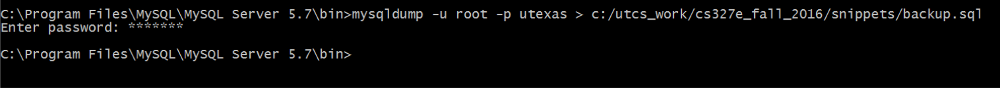

## CS 327E Final Project Learning Objectives:
1. Continue working with your database
2. Continue working with your partner
3. Revise the query interface from Lab 3 as needed
4. Learn to pull data from Twitter (or another RESTful API)
5. Learn to store JSON data in MySQL
6. Learn to extract and query JSON data using MySQL’s extensions 
7. Write a final report that summarizes your experiences

## Prerequisites:
1. Lab 1 completed
2. Lab 2 completed
3. Lab 3 completed
4. Final Project setup work completed

## Steps Outlined:
0. Perform any reworks and/or enhancements to your Lab 3 submission that were noted in your graded rubric. For example,
   if a query didn’t return the expected results, fix the SQL statement before proceeding with the work for the final
project. All updates to your Lab 3 submission should be done to the existing lab3 folder.
1. Create a new folder in your local git repository called final_project. All the work you do for this project will go
   into this folder.
2. Write an API client in Python that searches for a topic in Twitter (or another RESTful API that returns JSON) and
   stores the results into a MySQL table. The topic must share a foreign key relationship with one of your existing
tables. You must create a new table to store the API results in JSON and define relationships between the new JSON table
and the existing tables from the previous lab work. The raw JSON should be stored as JSON type in the new table. This
table should also have a primary key that is generated from the JSON document. In addition to the primary key, you may
choose to extract other values from the JSON document and store them as scalar values in the table. For details on the
anatomy of a tweet and how to use the Twitter Search API, review the Twitter Developer Documentation [4, 5]. For details
on how to store and manipulate JSON data in MySQL, review the assigned readings for 11/21, lecture slides for 11/16 and
11/21 on course website, as well as the JSON code samples on Github [6].  1 You must collect at least 50 records from
the API. If your search is too narrow and Twitter returns only a handful of results, you must broaden your search or
define additional searches. If you have defined multiple searches, you should store the results from each search into
its own MySQL table. Name the Python program api_client.py and add it to your local repo. Name the create table script
extend_database.sql and add it to your local repo. Commit both files and push the commit to your remote repo on Github.
3. Write some SQL queries to explore and analyze the JSON data from your database. You must come up with 5 different
   select statements, of which at least 2 must join the JSON table with its parent table via the foreign key column
defined in the previous step. Create a script called json_queries.sql with the above SQL queries. Make sure that each
statement is separated by a semicolon so that the script can be run inside of a SQL client tool such as MySQL Workbench.
For queries that require user input, show the query with example values inside of brackets. However, note that
user-input is not required for these queries. Commit the script to your team's local repo and push the commit to your
remote repo on Github.
4. Extend the command-line interface that you developed in Lab 3 with some additional menu options. Add one menu option
   for each SQL query that is in your json_queries.sql. If you have any select statements that require user input
should, take the input from the command-line and plug the values into the query as appropriate. The unchanging parts of
the select statements can be hard-coded into the Python program. All select statements should be executed through the
PyMySQL connector.  Use the function run_stmt() in db_connect.py to execute the select statements. Do not use
run_prepared_stmt() as we have found that it does not permit column names to be passed in as parameters. Name the script
extended_query_interface.py and add it to your repo. Commit the file to your local repo and then push the commit to your
remote repo on Github.
5. If you don’t have any JSON queries that require user input, you may proceed directly to the next step. For each JSON
   query that requires user input, you should add some basic protection for SQL injections just like in Lab 3. If the
user input is expected to be a numeric value, ensure that a valid number was passed. If the user input is expected to be
a string, check that it doesn’t contain the following substrings: 

    ~~~~~{.sql}  
    “; drop table”,   
    “; truncate table”   
    “; delete from”   
    “or 1=1”.    
    ~~~~~
If any of these “bad” substrings are found in the user input, print out an appropriate error message
without executing the SQL statement. Commit your updates to extended_query_interface.py and push the commit to your
remote repo on Github.

6. Create a backup of your MySQL database using the mysqldump utility. This program comes with MySQL server and it is
   located in the bin directory of the MySQL server installation. Use the following command to take the backup: 

    ~~~~~{.sh}
    mysqldump -u root -p your_db_name > backup.sql 
    ~~~~~
where your_db_name = the name of your MySQL database.  Below is a
screenshot of running mysqldump to backup the utexas database: 

Note that backup.sql is the backup file that is generated
from running the command. Once you have taken the backup, add it to your repo, commit the file, and then push the commit
to your remote repo on Github. You must ensure that the backup represents your latest database. If you make a change to
the database after taking the backup, you will need to take a new backup.
7. Write a final report that summarizes your experiences from the labs and final project. The report should describe the
   motivation for your project, your approach and solutions, advantages and drawbacks, as you experienced them from the
lab assignments. It should cover the data modeling and schema design aspects, the data collection and loading aspects,
and the query interface aspects of your solution. It should also describe any technical challenges that you have
encountered and how you and your partner worked through those challenges. The report should conclude with lessons
learned, unexpected results, unsolved problems or other issues that remain open.  The page count for the report is 10
pages (double-spaced). You may include screenshots in the report, but those will not count towards the page length.
Convert the report to pdf format and name the file report.pdf. Add the file to your local repo and commit it. Push the
commit to your remote repo on Github.
8. Ensure that all the files for your final project are on Github. Locate the last commit id that you are using for your
   submission and paste it into an email. Your email should also contain a link to your team's repo on Github. Address
the email to the professor and both TAs and carbon copy your lab partner. The subject of the email should be:
[CS327E][Final Project][\<TeamName\>], replacing \<TeamName\> with your actual team name. The email is due Tuesday, 12/06 at
11:59pm. If it's late, there will be a 10% grade reduction per late day. This late policy is also documented in the
syllabus. Note: only one member per team should send the submission email.  

## Coding Conventions:

1. Place all reusable code in functions. For example, the database connection code should be defined in its own function
   because it’s used throughout the program. If you are using db_connect.py, note that we have made some enhancements to
it, so be sure to pull the latest version from Github. 

2. Use basic error handling with try-except blocks. Catch only the errors that you can handle and exit the program when
   an error is fatal (e.g. missing input data file, invalid database connection, etc). Use print statements in the
except block to report the error regardless of whether you choose to continue or exit the program.

## Writing Conventions:

The report is a substantial component of this final project. It is critical that you give yourselves enough time to
write a report that is coherent, concise, organized, readable, and clear. Imagine that you are writing this for a
prospective employer who has a strong database background and would like to learn about your project without reading
every line of code you have written.  If you are not familiar with technical report writing, please consult the
following reference: 
[P. Valduriez, Some Hints to Improve Writing of Technical Papers,
1994.](http://www.cs.utexas.edu/~scohen/project/writing-hints.pdf)

## Teamwork & Collaboration:

1. We will have only 2 class meetings to work on the final project (11/28 and 11/30).
2. We expect each team to split up the work as evenly as possible between the two members.
3. We expect each team to make several commits throughout this project. We don’t want to see a single giant commit
   before the assignment is turned in!
4. We expect each team to use the Github Issue Tracker: opening tasks, assigning them, and tracking their status. We
   will be reviewing the Issue Tracker to ensure that both team members are contributing equally to the project.
  
## Resources:
### Final Project:
[1] Setup Steps: http://tinyurl.com/z7kruxl    
[2] Grading Rubric: http://tinyurl.com/j5ot5w9    
[3] Team Sign-up Sheet: http://tinyurl.com/j6hzgvw    

### Twitter:
[4] Twitter API Field Guide: https://dev.twitter.com/overview/api/tweets   
[5] Twitter Search API: https://dev.twitter.com/rest/public/search    

### JSON:
[6] JSON Code Samples: https://github.com/cs327e-fall2016/snippets (e.g. twitter_client.py, extend_utexas.sql, and analyze_tweets.sql).    
[7] JSON Path Online Evaluator: http://jsonpath.com    
[8] JSON Editor Online: http://jsoneditoronline.org    
